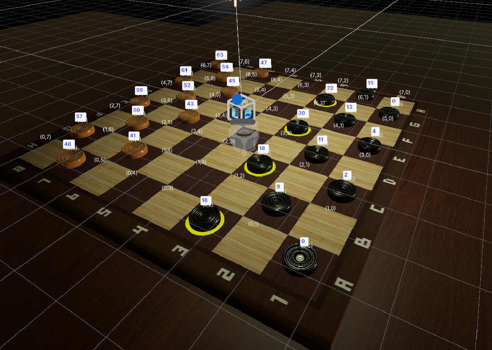
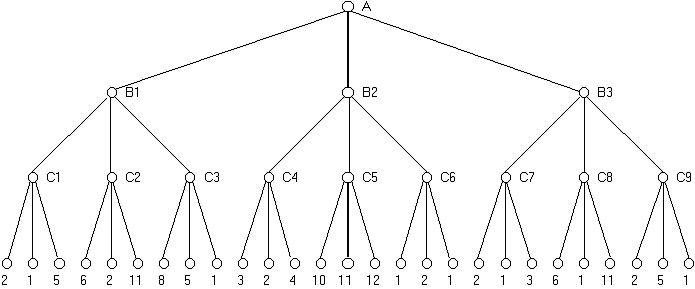
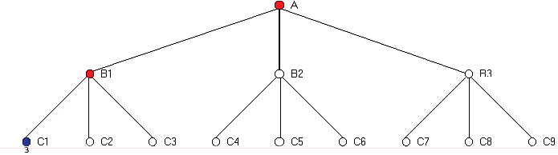

# Checkers AI with Minimax & Alpha-Beta Pruning

## 🎮 Gameplay

This project implements an **advanced Checkers game in Unity** with a powerful **AI opponent** using **Minimax and Alpha-Beta Pruning**. It offers multiple game modes and difficulty levels.

### 🕹️ Game Modes:
1. **Player vs Player (PvP)** – Two human players take turns.
2. **Player vs AI (PvAI)** – Play against an AI opponent with different difficulty settings:
   - **Easy** – Limited depth, basic moves.
   - **Medium** – Smarter decisions, better board evaluation.
   - **Hard** – Deep search, optimal strategy.
3. **AI vs AI (AIVsAI)** – Watch two AI opponents play against each other.

### 🏆 Rules:
- Players **move diagonally** and must **capture when possible**.
- A piece reaching the last row **becomes a King** and moves **both forward & backward**.
- The **game ends when a player has no more moves** or loses all their pieces.

---

## 🏗️ Code Architecture (Composition over Inheritance)

This project follows **Composition over Inheritance** to maintain a **clean and flexible design**.  
The **Singleton pattern** has been **limited to avoid tight dependencies**, ensuring better modularity.

### 🔹 Key Components:
- **GameManager** – Handles players, turns, and game state.
- **BoardHandler** – Manages the board and valid moves.
- **CheckerHandler** – Handles **piece selection, movement, and AI execution**.
- **AIHandler** – Implements **Minimax with Alpha-Beta Pruning** for AI moves.

### ✅ Why Composition?
- **More flexibility** – Each component has a clear responsibility.
- **Better reusability** – AI, board, and game logic are modular.
- **Avoids deep inheritance chains** – Reduces complexity.
- **Decoupled Systems** – **Singletons are only used for essential global states** (e.g., GameManager), while other components rely on **dependency injection** for better testability.

**Key takeaway**: **Singletons are kept to a minimum**, and **most components communicate through composition**, reducing unintended dependencies and making the system more **scalable and maintainable**. 🚀

---

## 🛠️ Debugging & AI Insights

To improve AI performance and **ensure accurate move evaluation**, a **debug mode** is included:



### 🔍 **How It Helps:**
✔ **Ensures AI correctly evaluates valid moves.**  
✔ **Helps debug movement errors** (e.g., jumping to an invalid square).  
✔ **Assists in testing AI algorithms**, ensuring Minimax and Alpha-Beta Pruning function properly.  

### 🏗️ **For Non-Technical Contributors:**
This debug mode allows **easy visual inspection** of how the game plays out.  
If the **AI makes a wrong move**, this view **helps identify potential issues** in the logic.

---

## 🧠 Minimax Algorithm with Alpha-Beta Pruning

The AI uses **Minimax**, a decision-making algorithm for **turn-based games**, optimized with **Alpha-Beta Pruning** to reduce unnecessary evaluations.

### 🔍 How Minimax Works:
1. **Expands possible moves** recursively, evaluating outcomes.
2. **Maximizing Player (AI)** picks the highest value move.
3. **Minimizing Player (Opponent)** tries to minimize AI’s best move.

### ✂️ Alpha-Beta Pruning:
- **Cuts off** branches **that won't affect the final decision**, speeding up computation.

### 📊 Example Minimax Tree:


Each **leaf node** represents a game state score, propagating **optimal decisions** back to the root.

### 🔥 Alpha-Beta Pruning in Action:


Each **red node** represents a **pruned branch**, meaning that the AI **did not need to explore** these moves.  
This optimization reduces the number of evaluated nodes, allowing the AI to **make faster and smarter decisions** without affecting the outcome.

### 🧠 How It Works:
1️⃣ **Evaluate leaf nodes** to determine game outcomes.  
2️⃣ **Propagate values upward** using Minimax.  
3️⃣ **Prune branches** where a move is already worse than an explored option.  
4️⃣ **Speed up decision-making** while maintaining accuracy.  

---

## 🚀 How to Run the Game
1. Clone this repository:
   ```bash
   git clone https://github.com/your-repo/checkers-ai.git
